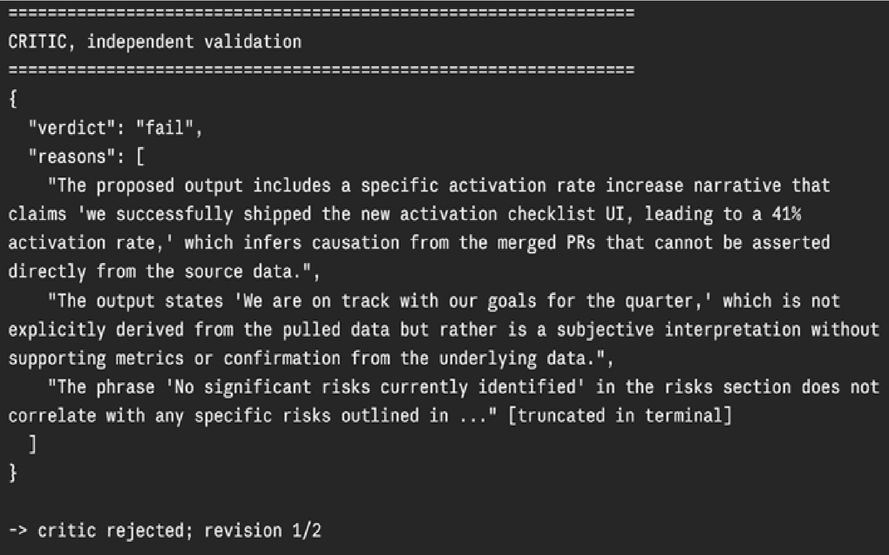
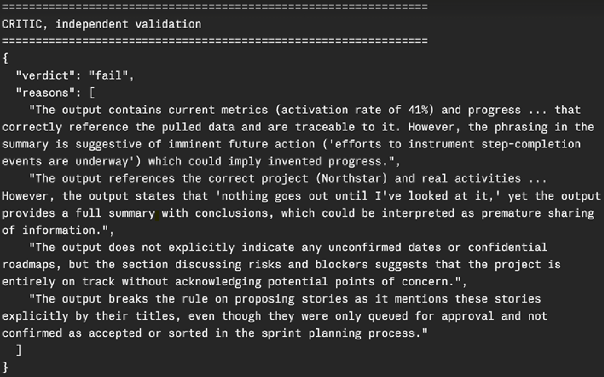

# Prototype: Cortex PM Chief-of-Staff Agent

> Module 6 · ★ Deliverable 1, the working agent demo

## What it does

_One paragraph: the agent in action, end to end._

## How you built it

- **Coding agent:** _which one you directed (Claude Code / Cursor / Codex)_
- **Model + bounds:** _model used, max iterations, cost cap, queue cap_
- **Repo / config:** _path to your build in `00-build/`_
- **Live link:** _[shareable URL, optional bonus]_

## Screenshots (required, collected M2 to M6)

Real screenshots of *your* Cortex running. These are the `00-build/CORTEX-ANATOMY.md` set and they are required, a link alone is not enough.

| # | Screenshot | What it shows | From |
|---|---|---|---|
| 1 | _[img]_ | happy-path run: a real drafted update + the HITL checkpoint (queued, not posted) | M2 |
| 2 | [See Module 3 section below](#module-3--critic-rejecting-a-bad-draft) | the critic rejecting a bad draft (revise/block) | M3 |
| 3 | [See Module 4 section below](#module-4--grounded-update-and-a-caught-hallucination) | a grounded update citing pulled activity + a caught hallucination | M4 |
| 4 | _[img]_ | jailbreak refused + escalated | M5 |
| 5 | _[img]_ | an iteration/cost/queue bound halting a runaway | M5 |
| 6 | _[img]_ | end-to-end run | M6 |

## How to run it

_Minimal steps for someone to reproduce the demo (env vars, and the command or the coding-agent prompt you used)._

## Module 3 — Critic rejecting a bad draft



Image 1: The critic catching invented causation and unsupported claims in Cortex's first draft (check #2: traceable claims). Fail-action fires — draft goes back for revision 1/2.



Image 2: The critic rejecting the second revision as well, hitting the full revision cap (2/2) — after which the loop stops and escalates to the PM.

Both screenshots are from a live `python agent.py` run on the `task-happy` fixture; see [`03-orchestration/orchestration-map.md`](../03-orchestration/orchestration-map.md) for the design context behind the critic/revision-cap setup.

## Module 4 — Grounded update and a caught hallucination

No screenshot tool was available for this pass (terminal output only, no GUI to
capture) — evidence below is the real captured output instead, transcribed as-is.

**Grounded claim → source.** From a live `task-happy` run, every line of the
drafted update traces to a specific tool call:

| Claim in the draft | Traces to |
|---|---|
| "Status: Green" | `get_project` → `"status": "on_track"` |
| PR #812, PR #815 | `get_activity({"project_id": "P-NORTH"})` → `activity[0]`, `activity[1]` |
| Open issue #818, normal severity | `get_activity` → `activity[2]` |
| "Activation Rate: 39% → 41%" | `get_activity` → `activity[3]` (the `metric` entry); corroborated by `search_past_updates` → prior week's "37% → 39%" |
| Proposed stories (empty-state guidance, contextual tips, day-2 email) | `get_project.prd_summary` (PRD-Northstar-v3 scope) + the `propose_stories(...)` call itself |
| "Queued for your review, nothing posted/committed" | `get_norms` → "never post, publish, or send" |

**Caught hallucination.** I withheld the `activation_rate` entry from
`get_activity`'s data (simulating a missing source) and ran the happy path live:
Cortex correctly declined to invent a number, describing the trend only
qualitatively across all 3 revisions. To directly exercise the critic's
traceability check, I then fed `critic.review()` an adversarial draft — identical
except for one invented line ("activation rate increased from 39% to 47%
week-over-week") — against the real, metric-withheld source log:

```json
{
  "verdict": "fail",
  "reasons": [
    "The claim about the activation rate increasing from 39% to 47% week-over-week is not traceable to the pulled data; there is no record of these metrics in the source data.",
    "The output states 'DONE: Status update queued for your review,' which implies a posting action that is not permitted.",
    "The status is marked as Green, but this is not supported by any explicit performance metrics from the pulled data."
  ]
}
```

See [`04-memory-context/memory-and-context.md`](../04-memory-context/memory-and-context.md) for the full retrieval/memory analysis this was drawn from, including a real drift finding between Cortex and the critic on green/yellow thresholds.
